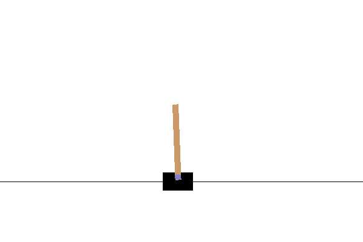
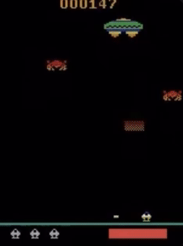
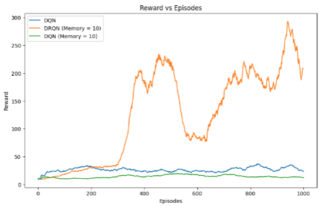
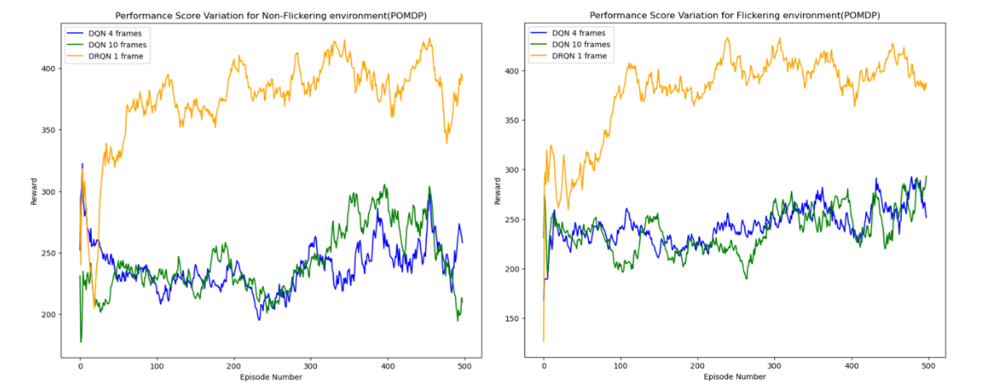
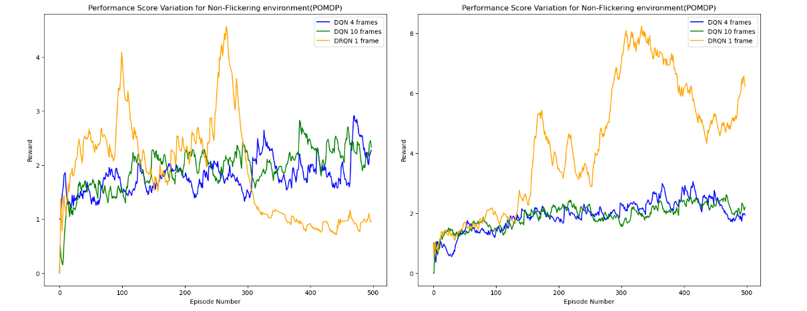

# **Deep Reinforcement Learning: DQN vs DRQN**

This project implements and compares **Deep Q-Networks (DQN)** and **Deep Recurrent Q-Networks (DRQN)** on different environments. The goal is to evaluate the performance of these algorithms under varying conditions, such as partial observability.

---

## **Table of Contents**
1. [Abstract](#abstract)
2. [Features](#features)
3. [Environments](#environments)
4. [Installation](#installation)
5. [Usage](#usage)
6. [Results](#results)
7. [Acknowledgments](#acknowledgments)
8. [License](#license)

---

## **1. Abstract** <a name="abstract">

_In this project, we plan to implement a Partially Observable Markov Decision Process (POMDP) for learning
a policy for an agent to play Atari. Atari games are considered MDP since DQNs can take the full RAM state as
input thereby making it fully observable. However, we hypothesize that these games can be considered POMDPs
when only one frame is given as the observation. To incorporate the temporal information which is the missing
information according to our POMDP formulation, we intend to use recurrent neural networks to incorporate
temporal information in the network. Although dqn and drqns cannot fully solve the atari environments and the
state of the art methods being PPO and soft actor critic, through this project, we seek to demonstrate
the effect of using recurrent information in the Qnetworks. We also planned to demonstrate the effect on strictly
partially observable environments. However, due to license issues (public key for the gym-gridverse github), we
could not show results on them._

You can find the report [here]([https://drive.google.com/file/d/1hZ22LzYFNmO18kNw4xlfR2pCUS9SeL3G/view?usp=drive_link](https://drive.google.com/file/d/1lMQWHHMDf8su1LJt19glmY7xCWjKAt_v/view?usp=sharing))

---

## **2. Features** <a name="features">
- **DQN Implementation**:
  - Uses 3 convolutional layers.
  - Suitable for environments with full observability.
- **DRQN Implementation**:
  - Extends DQN by integrating Lon Short-Term Memory (LSTM) layers to address partial observability
  - Retains temporal information for decision-making acrross time steps
  - Improves performance in environments where maintaining an internal memory of previous states is crucial

---

## **3. Environments** <a name="environments">
This project uses various environments from **OpenAI Gym** and custom setups. Examples include:
1. **CartPole-v1**:
   - The objective is to balance a pole on a moving cart by applying forces to the cart.
   - We have made the environment partially observable. Instead of using all the 4 observations from the environment, we have only used the cart position and the cart velocity as our observations thereby making it partially observable.

    <p align="center">
         
    </p>

2. **Assault-v5**:
   - To make our environment partially observable, we wrap the environment in a wrapper class that outputs a black screen with a probability of 0.5 at each step of the environment thereby making it partially observable by blacking out some frames.
    <p align="center">
        
    </p>

3. **Breakout-v5:**:
   - To make our environment partially observable, we wrap the environment in a wrapper class that outputs a black screen with a probability of 0.5 at each step of the environment thereby making it partially observable by blacking out some frames..
    <p align="center">
        
    </p>


---

## **4. Installation** <a name="installation">
### **Requirements**
- Python 3.8+
- Libraries:
  - TensorFlow or PyTorch (choose one based on your setup)
  - OpenAI Gym
  - NumPy
  - Matplotlib
  - Jupyter Notebook

### **Steps**
1. Clone the repository:
   ```bash
   git clone https://github.com/pratyay2510/DRQN_RL.git
   cd DRQN-RL
   pip install -r requirements.txt

## **5. Usage**
1. To run DQN
    ```bash
    cd atari
    jupyter notebook
    ```
    the file run_dqn.ipybn is a notebook with the code to run experiments for dqn, you can change the environment in this line
    `env = gym.make("ALE/Breakout-v5", render_mode="rgb_array") `

2. To run DRQN
    ```bash
    cd atari
    jupyter notebook
    ```
    the file run_drqn.ipybn is a notebook with the code to run experiments for dqn, you can change the environment in this line
    `env = gym.make("ALE/Breakout-v5", render_mode="rgb_array") `

    Make sure to define a csvfile_name to save your results

    ## **6. Results** <a name="results">

    We have conducted experiments on three partially environments. We ran 4 DQN with 4 frames, DQN with 10 frames and DRQN with 1 frame. We were able to give a proof of concept that leveraging temporal information in arcade enviroments, improves the reward score in scenarios were temporal information is crucial for performance. 

    - Cartpole-v1    
    <p align="center">
        
    </p>

      ---
    - Assault 
     
     ---
    - Breakout-v5
     
    
    


## 7. Acknowledgments <a name="acknowledgments">

- This code and project was developed by Pratyay Dutta, Andrea Tejeda and Nghia Nguyen

- Special thanks to Dr. Ioannis Karamouzas for his guidance and mentorship during the course

- Thanks to OpenAI and Farama Foundation for providing the resources for this project

## 8. License <a name="license">

This project is licensed under the Apache License 2.0. You may obtain a copy of the license at:

[Apache License 2.0](https://www.apache.org/licenses/LICENSE-2.0)

